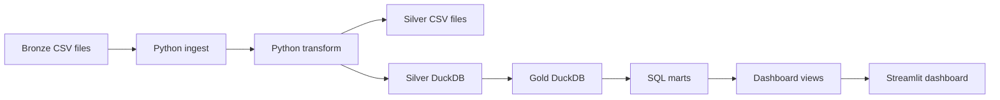

# Strikes on Ukraine Analytics

Analytics project for exploring reported missile and UAV strike activity in the war in Ukraine. The project builds a lightweight local data pipeline with Python, DuckDB, SQL, and Streamlit, then serves dashboard-ready marts through an interactive web app.

Live dashboard: [https://strikes-on-ukraine-analysis.streamlit.app/](https://strikes-on-ukraine-analysis.streamlit.app/)

The dashboard focuses on:

- strike activity trends over time
- launched and destroyed totals by weapon model and weapon type
- target area summaries and approximate centroid maps
- air defense success percentage by area

## Project Status

This project is under active development and deployed on Streamlit Community Cloud. The current version is a local and deployed MVP with a bronze/silver/gold data structure, DuckDB marts, and a Streamlit dashboard.

Data files and generated databases are intentionally not committed to Git. To run the project locally, add the source CSV files to `data/bronze/` and rebuild the DuckDB files with the pipeline.

## Data Source And License

This project uses the Kaggle dataset [Massive Missile Attacks on Ukraine](https://www.kaggle.com/datasets/piterfm/massive-missile-attacks-on-ukraine/data) by Kaggle user [piterfm](https://www.kaggle.com/piterfm).

The dataset is licensed under [Creative Commons Attribution-NonCommercial-ShareAlike 4.0 International](https://creativecommons.org/licenses/by-nc-sa/4.0/).

The original data has been transformed for this project. Changes include column normalization, date parsing, weapon reference enrichment, target area normalization, DuckDB silver/gold tables, and derived dashboard metrics such as air defense success percentage.

This project is intended for non-commercial educational and portfolio use.

The code in this repository and the dataset are licensed separately. The source dataset and any redistributed derived data outputs are based on the Kaggle dataset by piterfm and should keep the same CC BY-NC-SA 4.0 license and attribution.

## Tech Stack

- Python 3.12
- pandas for data cleaning and transformation
- DuckDB for local analytical storage
- SQL for dashboard marts and views
- Streamlit for the dashboard
- Plotly and PyDeck for charts and maps
- Kaggle API for source data download
- Poetry for local dependency management

## Data Flow



## Data Layers

### Bronze

`data/bronze/` contains the original source CSV files.

You can download the files with:

```bash
poetry run download-data
```

Expected local files after download:

```text
data/bronze/missile_attacks_daily.csv
data/bronze/missiles_and_uavs.csv
```

### Silver

`data/silver/` contains cleaned and normalized data. The pipeline currently writes both CSV files and a DuckDB database here.

Main outputs:

```text
data/silver/attacks_clean.csv
data/silver/attacks_regions.csv
data/silver/weapon_reference_clean.csv
data/silver/silver.duckdb
```

### Gold

`data/gold/` contains the analytics-ready DuckDB database used by the dashboard.

Main output:

```text
data/gold/gold.duckdb
```

The gold database contains physical mart tables and dashboard-facing views.

## Main Gold Tables

The SQL marts are created in `sql/marts.sql`.

| Mart | Purpose |
| --- | --- |
| `mart_overview_summary` | One-row KPI summary for the overview page |
| `mart_daily_activity` | Daily launched and destroyed totals with rolling averages |
| `mart_weapon_model_summary` | Weapon model level totals and reference coverage |
| `mart_weapon_type_summary` | Broader weapon category and type summaries |
| `mart_area_macro_summary` | Area macro totals, strike records, and air defense success percentage |
| `mart_directional_macro_summary` | Coarse north/south/east/west style map summaries |
| `mart_region_activity` | Oblast-level region activity for the specific region map |

Dashboard views are created in `sql/views.sql`. The Streamlit app reads the `vw_dashboard_*` views instead of querying raw mart names directly.

## How The Code Works

```text
src/ingest.py       Reads raw bronze CSV files.
src/download_data.py Downloads the source dataset from Kaggle into the bronze layer.
src/transform.py    Cleans columns, parses dates, normalizes weapon models, and maps targets to regions.
src/load.py         Writes silver CSV/DuckDB outputs and builds the gold DuckDB database.
src/pipeline.py     Runs the full bronze -> silver -> gold pipeline.
sql/marts.sql       Builds analytics-ready gold mart tables.
sql/views.sql       Creates stable dashboard-facing views.
dashboard/data.py   Opens read-only DuckDB connections for Streamlit queries.
app.py              Main Streamlit overview page.
pages/              Additional Streamlit pages for weapons and areas.
notebooks/          Local exploration notebooks.
```

Do not run the pipeline with `python src/pipeline.py`. The project uses package imports, so run it with Poetry or as a module.

## Local Setup With Poetry

Install dependencies:

```bash
poetry install
```

Configure Kaggle API credentials before downloading the source data. Create a Kaggle API token in your Kaggle account settings and configure it locally according to the Kaggle CLI instructions. If you keep credentials inside the project, use a `.kaggle/` directory; it is ignored by `.gitignore`.

Download the source CSV files:

```bash
poetry run download-data
```

Run the full pipeline:

```bash
poetry run pipeline
```

Start the dashboard:

```bash
poetry run streamlit run app.py
```

The dashboard runs locally in your browser, usually at:

```text
http://localhost:8501
```


## Querying The DuckDB Database

After running the pipeline, you can inspect the gold database directly from Python:

```python
import duckdb

connection = duckdb.connect("data/gold/gold.duckdb", read_only=True)

print(connection.execute("SHOW TABLES").fetchdf())
print(connection.execute("SELECT * FROM vw_dashboard_overview").fetchdf())

connection.close()
```

This is useful in notebooks before adding new charts to Streamlit.

## Important Metric Definitions

- `Strike records` means rows in the cleaned attack dataset. It should not automatically be interpreted as a perfectly deduplicated count of real-world attacks.
- `Launched total` means the reported number of launched weapons in the source data.
- `Destroyed total` means the reported number of destroyed weapons in the source data.
- `Air defense success %` is calculated as `destroyed_total / launched_total * 100`.
- Region maps use approximate centroid coordinates, not exact strike locations or official geographic boundaries.
- Some source rows are nationwide or unknown, so not all launched volume can be placed on a specific map point.
- Multi-region rows can be viewed as exploded totals or allocated totals. Allocated totals divide launched and destroyed values across the listed regions to reduce double counting in region-level comparisons.

## Project Structure

```text
ukrane-war-drone-analytics/
|-- app.py
|-- dashboard/
|   `-- data.py
|-- data/
|   |-- bronze/
|   |-- silver/
|   `-- gold/
|-- notebooks/
|-- pages/
|   |-- 1_Weapons.py
|   `-- 2_Areas.py
|-- sql/
|   |-- marts.sql
|   `-- views.sql
|-- src/
|   |-- download_data.py
|   |-- ingest.py
|   |-- load.py
|   |-- pipeline.py
|   `-- transform.py
|-- pyproject.toml
|-- requirements.txt
`-- README.md
```

## Data Limitations

This project depends on public source data. Before publishing or redistributing derived data, document:

- original data source and license: Kaggle dataset by piterfm, CC BY-NC-SA 4.0
- update frequency
- known missing values
- whether source rows represent attacks, reports, or weapon launch events
- how nationwide, unknown, and multi-region target values are handled
- limitations of approximate map centroids


## Future Improvements

- Add data quality checks for nulls, duplicate rows, and impossible values.
- Add tests for transform logic and SQL mart assumptions.
- Add a source documentation page to the dashboard.
- Add GitHub Actions for scheduled pipeline runs.
- Add more geographic validation for region mapping.
- Add screenshots and architecture images to `docs/`.

## Portfolio Summary

Built an end-to-end strike analytics project using Python, SQL, DuckDB, and Streamlit. Designed a local medallion-style data pipeline to ingest public CSV data, clean and normalize weapon and target fields, create analytics-ready DuckDB marts, and serve interactive dashboard pages for trend, weapon, area, and air defense analysis.
